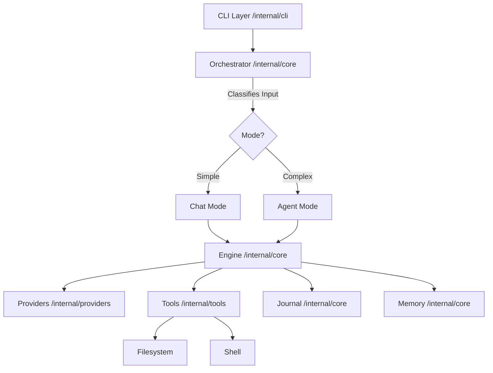

# 🏛️ Cordenex v2 Architecture

This document describes the internal design and data flow of the Cordenex Autonomous Engineering system.

## 🧱 Component Overview

---

## 1. 🧠 Core Components

### `Engine` (`internal/core/engine.go`)
The `Engine` is the central executor. It is responsible for:
-   Managing the **Conversation History**.
-   Building the **System Prompt** (merging core rules + `CORDENEX.md` + context).
-   Handling the **Agentic Loop** (LLM Call -> Tool Execution -> Loop).
-   Recording results in the **Journal**.

### `Orchestrator` (`internal/core/orchestrator.go`)
The `Orchestrator` acts as a router/dispatcher. It uses complexity signals (word count, file patterns, multi-step keywords) to decide if a task should be handled by a single LLM turn (Chat) or a full autonomous loop (Agent).

### `Project Memory` (`internal/core/memory.go`)
Manages `CORDENEX.md`. This file allows users to define constraints (e.g., "Always use TypeScript for new files", "Never modify the /vendor folder") that the AI MUST follow.

### `Permission Manager` (`internal/core/permissions.go`)
Enforces safety. It categorizes every tool as `ReadOnly`, `Write`, or `Dangerous`. It handles the logic for auto-approving batches of tools to avoid "approval fatigue" while maintaining security.

---

## 2. ⚡ The Agentic Loop

Cordenex follows a strict **Plan-Act-Verify** loop:

1.  **Thinking**: The AI generates a `<thinking>` block to plan its next steps.
2.  **Tool Call**: The AI requests tool execution (e.g., `write_file`).
3.  **Approval**: The `PermissionManager` checks if user confirmation is required.
4.  **Parallel Execution**: Tools are executed concurrently using Go's `sync.WaitGroup` to minimize latency.
5.  **Self-Healing**: If a tool fails (error code or stderr), the `Engine` interprets the error and provides a corrective prompt to the LLM for an automatic retry.

---

## 🛠️ Tool System (`internal/tools`)

Tools are designed to be safe and robust:
-   **Filesystem**: Implements `securePath` with case-insensitive normalization to prevent path traversal on Windows and Unix.
-   **Undo**: Every write/delete operation is recorded in a `ChangeSet` buffer. The `/undo` command can revert these byte-perfectly by restoring previous file states.
-   **Search**: Uses a combination of regex search and glob patterns to build the AI's "sight" of the codebase.

---

## 📡 Provider Layer (`internal/providers`)

Cordenex abstracts providers to allow seamless switching:
-   **Streaming**: All providers support `Server-Sent Events` style streaming for a fast, responsive UI.
-   **Tool Definition Mapping**: Each provider handles its own specific JSON Schema format for tool calling (Anthropic vs OpenAI vs Gemini).

---

## 📝 Session Management (`Journal`)

The `Journal` resides in `~/.cordenex/journal.json`. It tracks:
-   **Total sessions** and task success rate.
-   **Cumulative token usage and cost**.
-   **Touch history**: Which files were modified across different sessions.
-   **Resumption Context**: When you start a new session, the Journal provides a summary of the *last* session so the AI remembers where it left off.
